# Wiki del Proyecto: \[OrderNow]

## Índice

1. [Introducción](#introducción)
2. [Análisis de Requisitos](#análisis-de-requisitos)
3. [Diseño del Sistema](#diseño-del-sistema)
4. [Implementación](#implementación)
5. [Pruebas](#pruebas)
6. [Gestión del Proyecto](#gestión-del-proyecto)
7. [Anexos](#anexos)

---

## Introducción

En el presente informe, se aborda y se explica el análisis e implementación de un sistema de Pedido de Comidas a cargo de estudiantes de 5to semestre. El objetivo principal es que los usuarios puedan pedir comida del restaurante que elijan y, con ayuda del sistema de delivery, se les haga llegar.

* Descripción general del sistema  

El proyecto OrderNow es un sistema que tiene como objetivo facilitar a los usuarios poder pedir comida del local y/o restaurante que deseen, proporcionandoles una interfaz simple y sencilla por cual ellos no tengan complicaciones y cuenten con con un subsistema de delivery que les facilite la entrega.
* Objetivo General  

LLevar a cabo la  implementación de un sistema de pedido y entrega de comida para ofrecer una excelente calidad de servicios a los clientes involucrados mediante el correcto uso de metodologías ágiles, patrones de diseño y buenas prácticas de desarrollo.

* Objetivos específicos  

Diseñar e implementar una interfaz limpia y clara para los usuarios, restaurantes y repartidores donde se permita navegar entre restaurantes, platos y coordinar los pedidos.      

Integrar un subsistema de localización geográfica para facilitar la colocación de ubicación tanto para usuarios como para repartidores.  

Desarrollar pruebas para garantizar la calidad del desarrollo en todas sus fases y asegurar un buen producto final.
    
* Alcance  

Este proyecto pretende beneficiar principalmente a estudiantes de la Universidad Católica Boliviana los cuales, de lunes a viernes consumen comidas de restaurantes que se encuentran al frente de la Universidad, uno de los medios principales a utilizar es por aplicación móvil y se estima que el proyecto esté terminado en aproximadamente 2 meses.
* Stakeholders  

Clientes  
Realizan pedidos, consultan el menú, pagan y reciben la comida.  

Restaurantes  
Administran su menú, reciben pedidos, preparan la comida.  

Repartidores  
Recogen los pedidos en los restaurantes y los entregan a los clientes.  

Administradores del sistema  
Supervisa el funcionamiento de la plataforma, gestiona usuarios, resuelve incidencias.

* Glosario de términos (metodologías, tecnologías, conceptos)  

Scrum  
Marco de trabajo ágil utilizado para gestionar proyectos complejos, especialmente en desarrollo de software. Se basa en iteraciones cortas llamadas sprints y promueve la colaboración, la adaptabilidad y la mejora continua.  

Daily  
Reunión diaria de corta duración (aprox. 15 minutos) donde el equipo de desarrollo sincroniza actividades, responde qué hizo ayer, qué hará hoy y si tiene o tuvo impedimentos.  

Retrospectiva  
Ceremonia que se realiza al final de cada sprint para reflexionar sobre lo que funcionó, lo que no, y cómo mejorar en el próximo sprint.  

Ceremonia  
En Scrum, se refiere a las reuniones o eventos formales del marco de trabajo, como la Daily, Sprint Planning, Sprint Review y Retrospective.  

### Tecnologías  

React  
Biblioteca de JavaScript para construir interfaces de usuario interactivas, especialmente en aplicaciones web de una sola página (SPA). Desarrollada por Facebook.  

Node  
Entorno de ejecución para JavaScript en el servidor. Permite crear aplicaciones backend usando JavaScript.  

JSON 
Formato ligero de intercambio de datos basado en texto. Muy usado para comunicar datos entre servidores y clientes (API).  

Supabase  
Plataforma de backend como servicio (BaaS) que ofrece una alternativa de código abierto a Firebase. Proporciona base de datos (PostgreSQL), autenticación, almacenamiento y funciones en tiempo real.  

Excalidraw  
Herramienta de dibujo colaborativo enfocada en crear diagramas de manera rápida, con un estilo "hecho a mano". Muy útil para prototipos, wireframes o mapas de ideas.  

Figma  
Herramienta de diseño de interfaces y prototipado colaborativo basada en la nube. Permite a diseñadores y desarrolladores trabajar juntos en tiempo real para crear wireframes, prototipos interactivos y diseños de alta fidelidad para aplicaciones web o móviles

---

## Análisis de Requisitos

* Listar todas las Historias de usuario trabajadas, separadas por sprint
### Sprint 1
### Sprint 2
### Sprint 3
### Sprint 4
[Link HDU](http://159.69.123.44/isw/browse/TALLE-246/)
### Sprint 5
[Link HDU](http://159.69.123.44/isw/browse/TALLE-233/)
### Sprint 6
### Sprint 7
### Sprint 8
[Link HDU](http://159.69.123.44/isw/browse/TALLE-361/)

---

## Diseño del Sistema

* Adjuntar Diagrama de la Arquitectura general a implementar según el estado actual del proyecto (diagrama + explicación)
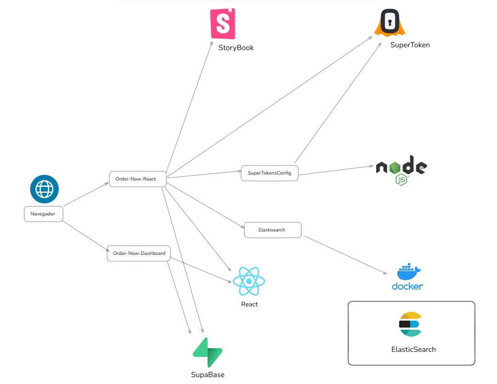  

Tenemos dos proyectos principales en la aplicación:  
Order-Now-React y Order-Now-Dashboard  
El usuario ingresa por el navegador a Order-Now-React la cual, está hecha en React y es la principal que se encarga de manejar la experiencia de usuario.  
Usamos Storybook que es una herramienta de desarrollo para documentar y visualizar componentes de UI. 

Este cliente:  
Se comunica con SupaBase para obtener los datos de los restaurantes, de los platillos.  
Puede usar Elastisearch, el cual está montado en docker, para realizar búsquedas.  
Usa SuperTokens para la autenticación. Además de estar vinculado al frontend mediante SuperTokensConfig.  

Los restaurantes acceden a través del Order-Now-Dashboard.

* Adjuntar Diagrama de Modelo entidad-relación (ER) tipo UML
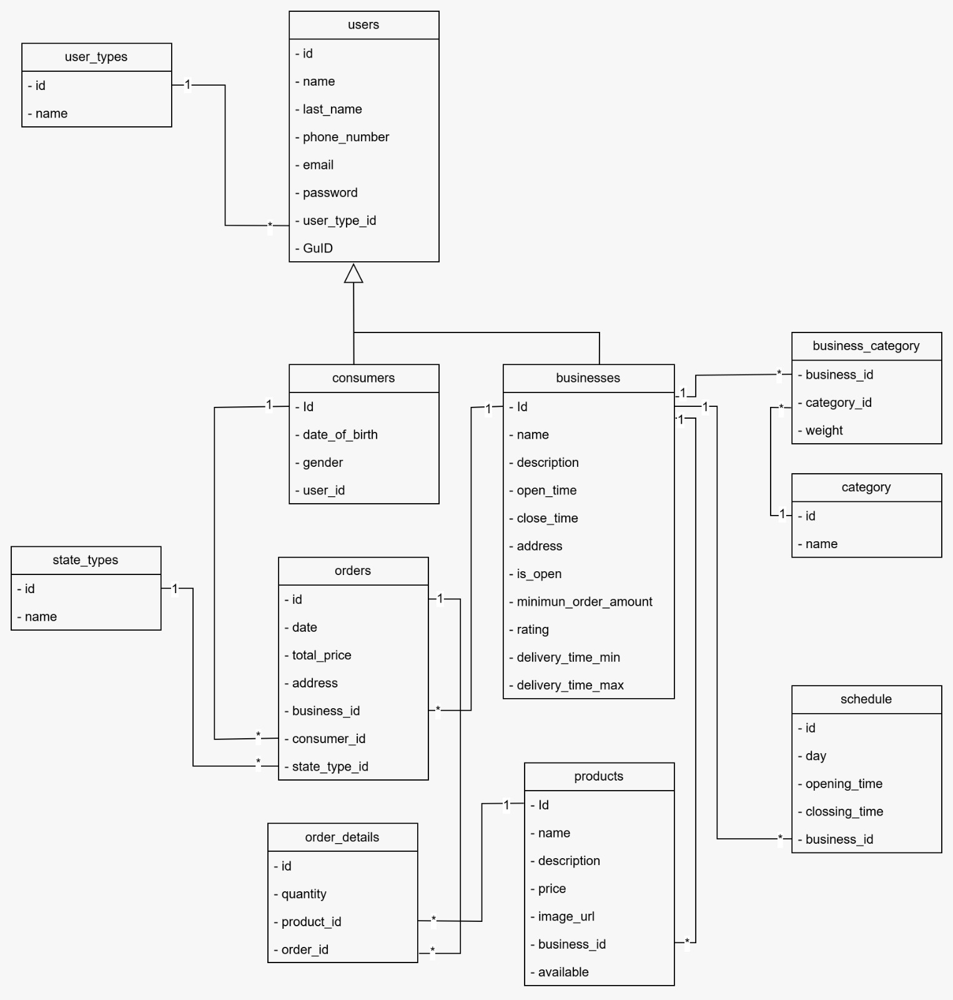
* Adjuntar Diseños de interfaces de usuario (mockups, wireframes)  

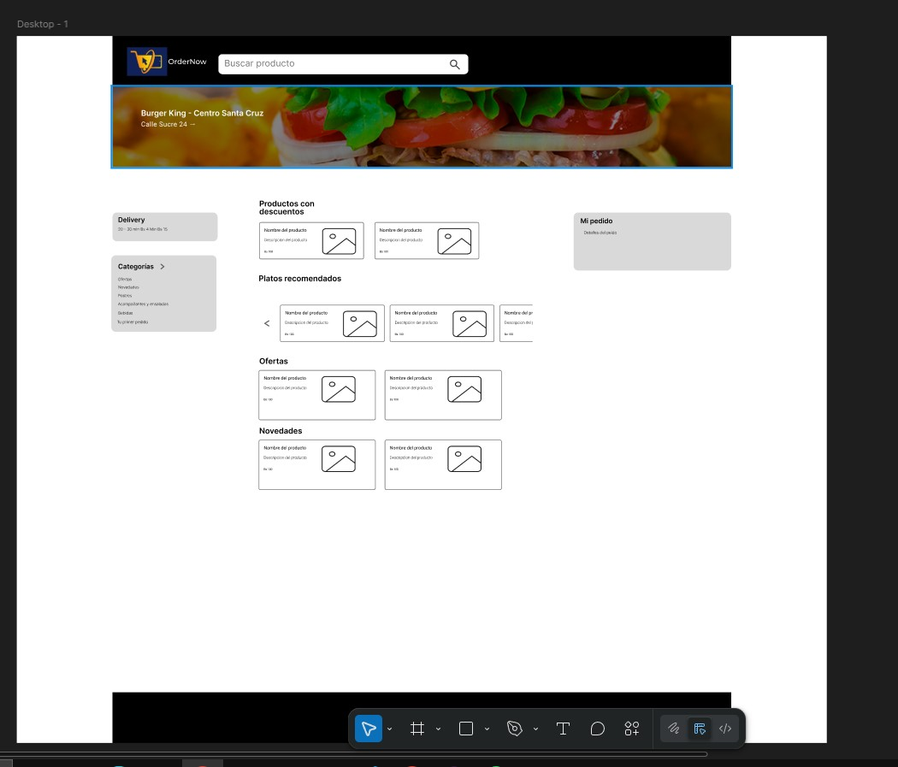
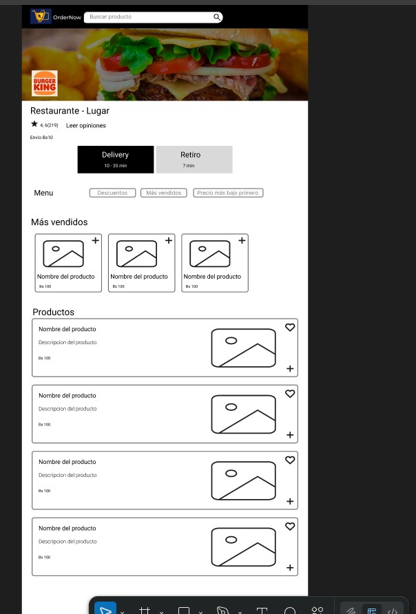
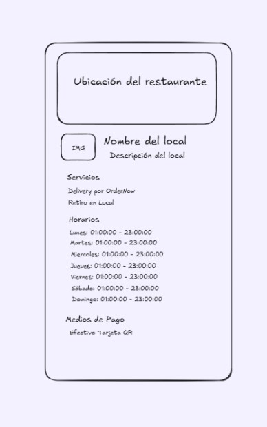
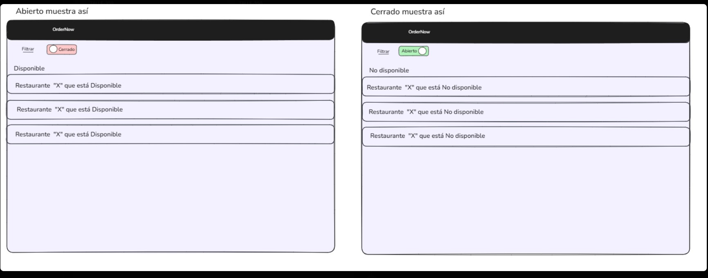

---

## Implementación
**URL Repositorio: ([Link al Repositorio](https://github.com/ucb-scz-dims/SIS-213-ON.git))**
**Enlace del tablero: ([Link al tablero](http://159.69.123.44/isw/projects/323b25a8-5981-4168-b11d-3f5024224d09/issues))**

Explicar un patrón de diseño que se puede implementar en el proyecto. Documenta los siguientes puntos:
 - Adjunta una porción de código o códigos que tengan un problema o deficiencia de calidad de código

Logica de obtención de datos desde supabase
 <pre>  
const supaBaseCom = getSupaBaseClient('com');  
const { data: biz, error: errBiz } = await supaBaseCom
  .from('businesses')  
  .select('*')  
  .eq('id', id)  
  .single();
 </pre>

 El componente Modal maneja lógica de datos, errores.
 <pre>  
 useEffect(() => {  
    const fetchData = async () => {  
      try {  
        const { data: biz, error: errBiz } = await supaBaseCom  
          .from('businesses')  
          .select('*')  
          .eq('id', id)  
          .single();  
        if (errBiz) throw errBiz;  
        setBusiness(biz);  
        const { data: schedRows, error: errSched } = await supaBaseCom  
          .from('schedule')  
          .select('day, opening_time, clossing_time')  
          .eq('business_id', id)  
          .order('day', { ascending: true })  
          .order('opening_time', { ascending: true });  
        if (errSched) throw errSched;  
        const grouped = schedRows.reduce((acc, row) => {  
          const d = row.day;  
          if (!acc[d]) acc[d] = [];  
          acc[d].push(`${row.opening_time.slice(0,5)} – ${row.clossing_time.slice(0,5)}`);  
          return acc;  
        }, {});  
        setSchedule(grouped);  
      } catch (error) {  
        alert('Error cargando datos del negocio u horarios.');  
      } finally {  
        setLoading(false);  
      }  
    };  
    fetchData();  
  }, [id, supaBaseCom]);  

 </pre>  

Agrupamiento de horarios ocurre directamente en la UI.  

 <pre>  
 const grouped = schedRows.reduce((acc, row) => {  

  const d = row.day;  
  if (!acc[d]) acc[d] = [];  
  acc[d].push(`${row.opening_time.slice(0,5)} – ${row.clossing_time.slice(0,5)}`);  
  return acc;
}, {});

 </pre>

 - Explica el patrón de diseño que puede solucionar este problema  
## Patrón Facade  
Este patrón me pemite encapsular la complejidad de multiples funciones bajo una simple interfaz, por ejemplo se centralizó la obtención de los datos del negocio (horarios, detalles, métodos de pago) en una facade.

## Patrón Presentational/Container
Se separó la lógica (Container) de la presentación visual (Presentational):
Container: obtiene y gestiona los datos.
Presentational: renderiza una vista con base en los datos recibidos.

 - Adjunta la solución implementada: Diagrama, pseudocódigo, diagrama de flujo, código refactorizado, todas las evidencias necesarias  

 ### Diagramas
 #### Facade encargado de la obtención de datos
 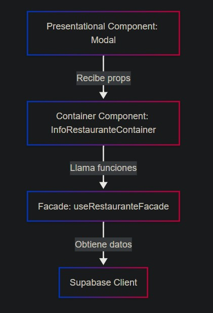

<pre>

const supabase = getSupaBaseClient('com');

const RestauranteFacade = {
  async obtenerRestaurantePorId(id) {
    const { data, error } = await supabase
      .from('businesses')
      .select('*')
      .eq('id', id)
      .single();
    if (error) throw error;
    return data;
  },

  async obtenerHorarioPorRestaurante(id) {
    const { data, error } = await supabase
      .from('schedule')
      .select('day, opening_time, clossing_time')
      .eq('business_id', id)
      .order('day', { ascending: true })
      .order('opening_time', { ascending: true });
    if (error) throw error;

    return data.reduce((acc, row) => {
      const d = row.day;
      if (!acc[d]) acc[d] = [];
      acc[d].push(`${row.opening_time.slice(0, 5)} – ${row.clossing_time.slice(0, 5)}`);
      return acc;
    }, {});
  },
};

export default RestauranteFacade;
</pre>

 #### Presentational/Container obtiene y gestiona los datos
 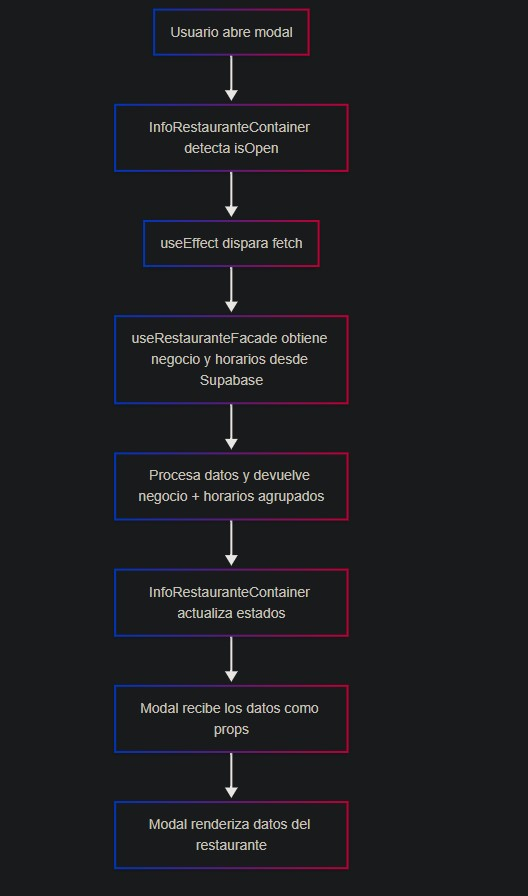

 <pre>
 import { useEffect, useState } from 'react';
import { useParams } from 'react-router-dom';
import RestauranteFacade from '../facades/RestauranteFacade';
import InfoRestauranteView from '../components/InfoRestauranteView';

function InfoRestauranteContainer({ isOpen, onClose }) {
  const { id } = useParams();
  const [business, setBusiness] = useState(null);
  const [schedule, setSchedule] = useState({});
  const [loading, setLoading] = useState(true);

  useEffect(() => {
    const cargarDatos = async () => {
      try {
        const [biz, horarios] = await Promise.all([
          RestauranteFacade.obtenerRestaurantePorId(id),
          RestauranteFacade.obtenerHorarioPorRestaurante(id),
        ]);
        setBusiness(biz);
        setSchedule(horarios);
      } catch (e) {
        alert('Error al cargar los datos del restaurante');
      } finally {
        setLoading(false);
      }
    };

    if (isOpen) {
      cargarDatos();
    }
  }, [id, isOpen]);

  return (
    <InfoRestauranteView
      isOpen={isOpen}
      onClose={onClose}
      business={business}
      schedule={schedule}
      loading={loading}
    />
  );
}

export default InfoRestauranteContainer;
 </pre>

#### Presentational
 <pre>
 const DAY_NAMES = {
  1: 'Lunes',
  2: 'Martes',
  3: 'Miércoles',
  4: 'Jueves',
  5: 'Viernes',
  6: 'Sábado',
  7: 'Domingo',
};

function InfoRestauranteView({ isOpen, onClose, business, schedule, loading }) {
  if (!isOpen) return null;

  if (loading) {
    return 
Cargando detalles...
;
  }

  if (!business) {
    return 
No se encontró el negocio.
;
  }

  return (
    <>
    Aqui va todo lo que se renderizaría, pero ocupa mucho espacio y no es tan relevante
    </>
  )
export default InfoRestauranteView;
 </pre>

---

## Pruebas

* Evidencias de pruebas (capturas, logs) de por lo menos 8 historias de usuario

Debido a los hechos mencionado posteriormente, no llego a cumplir las 8 historias de usuario, sólo 3 historias de usuario

### Modal de informacion restaurante
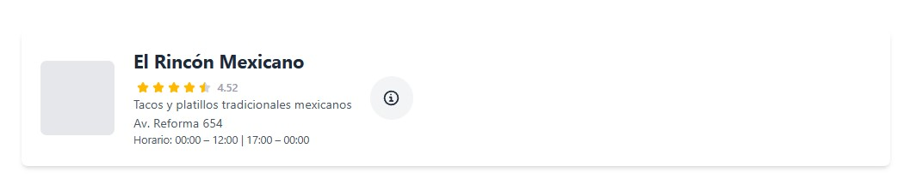  

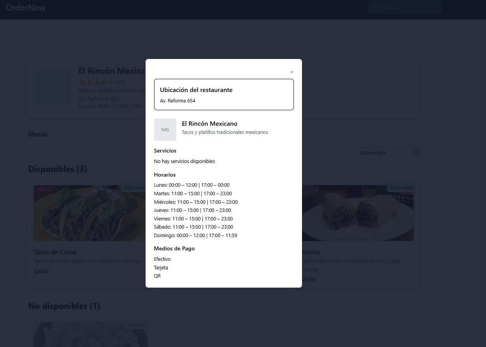  

### Barra de filtrado
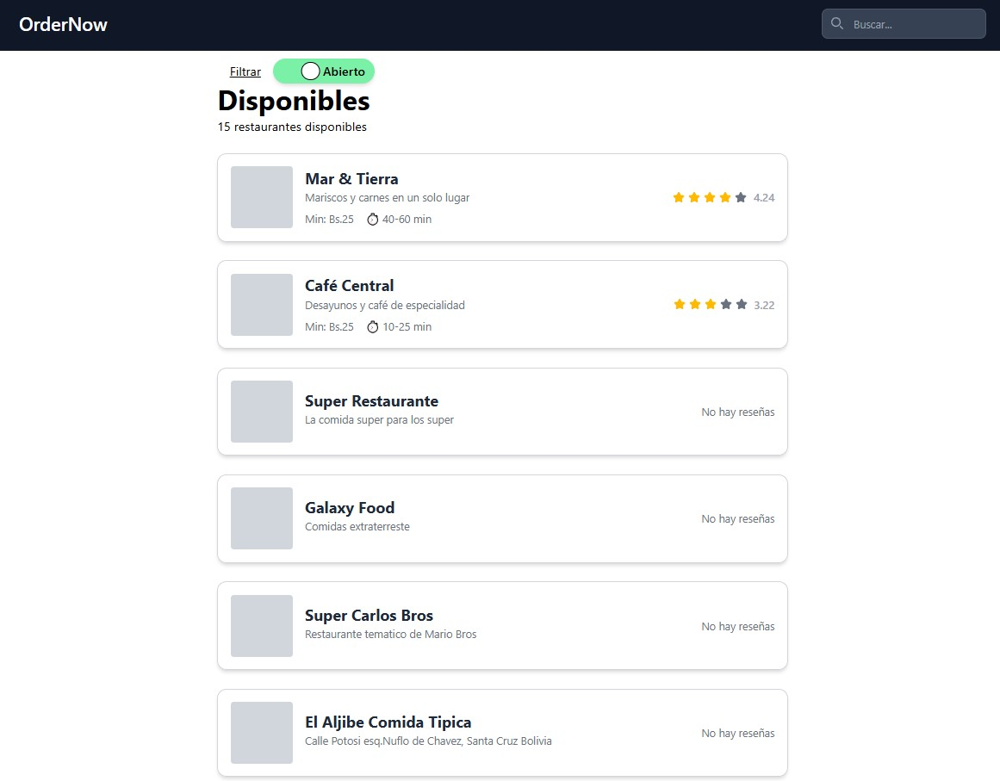
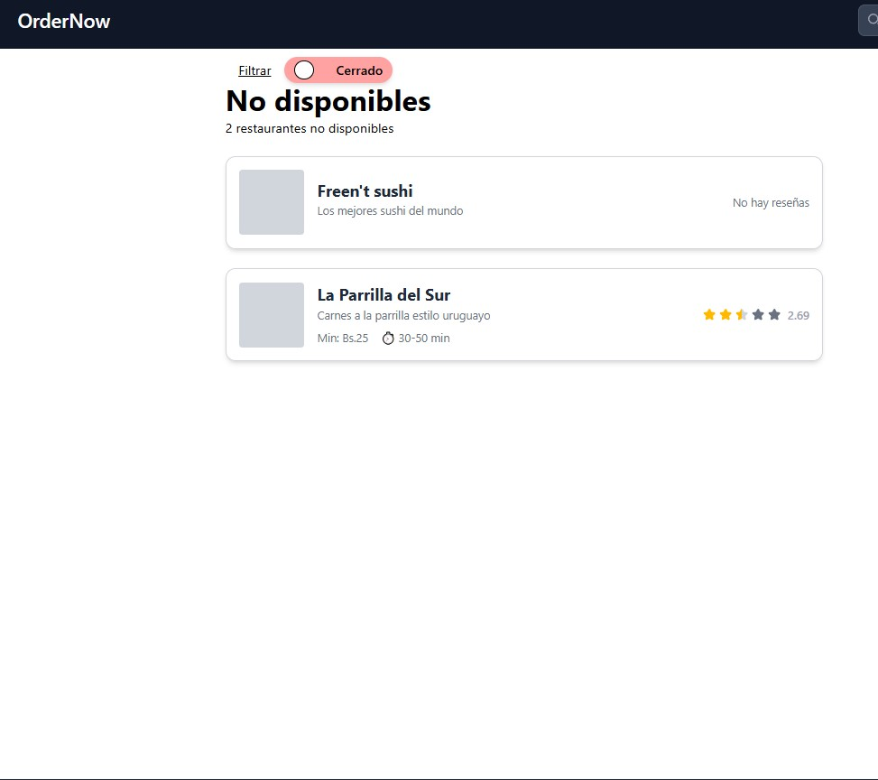

---

## Gestión del Proyecto

* Lecciones aprendidas. Redacta una sección sobre las lecciones más importantes que has aprendido trabajando en este proyecto  
La  verdad, después de redactar y documentar mi progreso me doy cuenta de la falta de responsabilidad y compromiso que tengo, algo que esto me enseña es que los trabajos, aunque parezcan pequeños si son constantes pueden marcar una diferencia enorme en trabajos largo y de equipo.
Ademas, siempre es bueno preguntar eso ahorra mucho tiempo a la hora de desarrollar, como tambien ir llevando registro de los avances, pueden ayudar a la hora de hacer tareas como esta misma.
* Cronograma / Diagrama de Gantt con los días reales de trabajo de cada Historia de usuario. Puedes utilizar la plantilla adjuntada o bien tu propio documento  
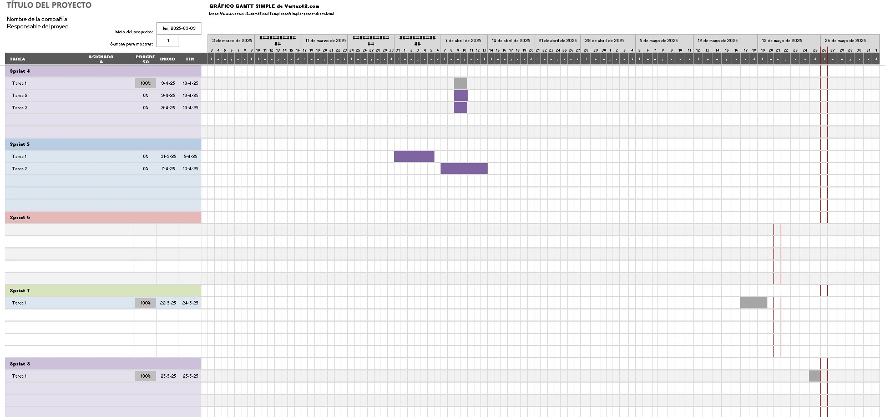

* Métricas del trabajo realizado por sprint (Utilizar Plantilla)
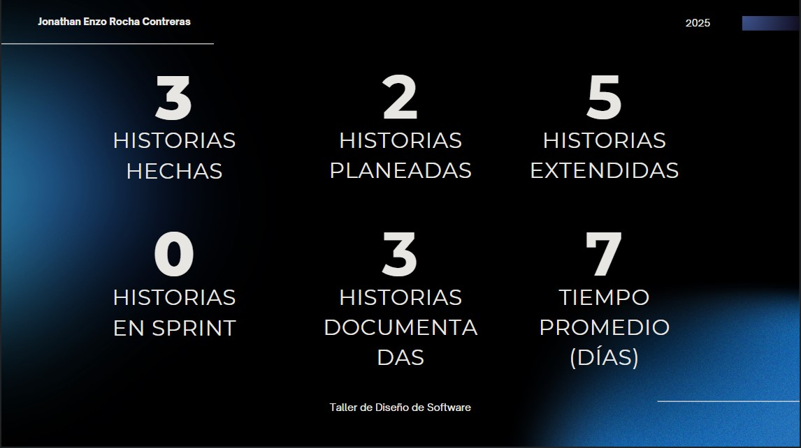

---

## Anexos

* Presentación en PPT de la gestión del proyecto  
[Presentación del proyecto (PPT)](./anexos/GestiondeProyecto-OrderNow.pptx.pptx)

---
